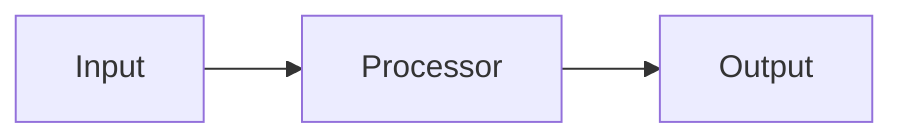

# GitHub README Authoring Skill

## Purpose

Create README.md files that convert visitors into users/contributors. Every section serves a decision: **install → try → understand → trust → contribute**.

## Required Sections (in order)

```markdown
# Project Title

[Badges row: CI, version, license, downloads, chat]

> One-sentence tagline. What problem does this solve for *me*?

## Why [Project]? / Problem Statement

2-3 paragraphs. Frame the pain point, show the gap, position your solution.

## Features

- ✅ Feature 1 (with emoji checkmarks)
- ✅ Feature 2
- 🔄 Feature 3 (planned)

## Quick Start / Installation

```bash
# One-liner install
pip install your-package
# or
npm install your-package
# or
curl -sSL https://install.yourproject.sh | bash
```

## Minimal Working Example

```python
# 5-10 lines that produce visible output
from your_package import main
result = main.do_thing("input")
print(result)  # → shows actual output
```

## Usage / CLI / API Reference

### CLI
```bash
your-cli --help
your-cli command --flag value
```

### Python API
```python
from your_package import Client
client = Client(api_key="...")
result = client.method(param="value")
```

### Configuration
```yaml
# config.yaml
setting: value
nested:
  option: true
```

## Architecture / How It Works



Or ASCII:
```
┌─────────┐    ┌──────────┐    ┌────────┐
│ Source  │───▶│ Processor│───▶│ Sink   │
└─────────┘    └──────────┘    └────────┘
```

## Configuration Reference

| Variable | Required | Default | Description |
|----------|----------|---------|-------------|
| `API_KEY` | Yes | — | Your API key |
| `LOG_LEVEL` | No | `INFO` | `DEBUG`, `INFO`, `WARN`, `ERROR` |

## Examples / Recipes

### Use Case 1: Basic
```python
# code
```

### Use Case 2: Advanced
```python
# code
```

## Contributing

```bash
git clone https://github.com/owner/repo
cd repo
pip install -e ".[dev]"
pytest
```

See [CONTRIBUTING.md](CONTRIBUTING.md) for guidelines.

## License

[MIT](LICENSE) / [Apache-2.0](LICENSE) — © 2024 Author

## Support / Community

- 💬 [Discord](https://discord.gg/...)
- 🐛 [Issues](https://github.com/owner/repo/issues)
- 📖 [Docs](https://docs.yourproject.com)
- 🐦 [Twitter/X](https://x.com/...)

---

## Badge Templates

```markdown


```

## Anti-Patterns to Avoid

| ❌ Don't | ✅ Do |
|----------|-------|
| Wall of text before install | Install command in first 10 lines |
| No working example | Runnable snippet with expected output |
| Only CLI, no API (or vice versa) | Both, clearly separated |
| "See docs for config" | Inline table with all options |
| Vague "contributions welcome" | Link to CONTRIBUTING.md + good first issues |
| No license | SPDX identifier + LICENSE file |

## Real-World Reference READMEs

| Project | Strength |
|---------|----------|
| [httpx](https://github.com/encode/httpx) | Clean API docs, async/sync examples |
| [rich](https://github.com/Textualize/rich) | Visual demos, feature grid |
| [fastapi](https://github.com/tiangolo/fastapi) | Minimal example, auto-generated API ref |
| [pydantic](https://github.com/pydantic/pydantic) | Migration guide, benchmarks |
| [ruff](https://github.com/astral-sh/ruff) | Speed comparison table, config reference |

## Checklist Before Publishing

- [ ] Title + tagline visible without scrolling
- [ ] Install command copy-pasteable
- [ ] Working example runs in <30 seconds
- [ ] All config options documented
- [ ] Badges render (click to verify)
- [ ] Links work (no 404s)
- [ ] License file exists and matches badge
- [ ] CONTRIBUTING.md linked
- [ ] Issue templates exist
- [ ] Changelog / releases linked

---

## Hermes Skill Mode (for `agentskills.io` skills)

When the artifact is a **Hermes Agent skill** (a `SKILL.md` in `category/skill-name/`), use this structure instead of the package template. Skills install via `hermes skills install`, not pip.

```markdown
# <Skill Name>

> **Tagline.** One sentence: what does this skill let Hermes do that it couldn't before?

## Why this skill?

2-3 sentences. The pain point (e.g. "parallel agent fan-outs fail silently when a
retried worker late-completes the wrong dispatch") and how the skill closes it.

## What it does

- ✅ Capability 1 (concrete)
- ✅ Capability 2
- 🔄 Planned / caveat

## Install

```bash
hermes skills tap add <owner>/<repo>
hermes skills install <skill-name>
```

## Quick Start

```text
In chat: "<natural-language trigger that invokes the skill>"
```

Or load explicitly:
```bash
hermes skill <skill-name>
```

## How it works

ASCII or short prose of the execution flow:

```
input → phase 1 → phase 2 → output
```

Reference the `SKILL.md` phases. Link to `references/` for deep dives.

## Usage / Examples

### Basic
<short real example: prompt + what Hermes does>

### Advanced
<multi-step or combined-with-other-skill example>

## File layout

| Path | Purpose |
|------|---------|
| `SKILL.md` | Definition: frontmatter + phased instructions |
| `references/` | Deep-dive docs, API notes, gotchas |
| `templates/` | Prompt bodies / config templates |
| `scripts/` | Runnable helpers |

## Related skills

- `<other-skill>` — <one line on how they combine>

## Notes / caveats

- Security: <e.g. mount keys via credentials, never inline>
- Limits: <e.g. concurrency cap, circuit breaker>

## License

MIT — © <year> <author>
```

**Differences from package mode:** no PyPI/CI badges, install is `hermes skills install`,
"Minimal Working Example" becomes a chat trigger, "API Reference" becomes file-layout table.
Generate the README FROM `SKILL.md` frontmatter (name/description) but EXPAND it by hand —
never ship a stub that only echoes the frontmatter.

## Decision: package vs skill

- Repo is a code library/CLI → use the package template below.
- Repo/folder is a Hermes skill (`SKILL.md` present) → use Hermes Skill Mode above.


## References

- `templates/README.template.md` — Full copy-paste template with all sections, badges, and examples